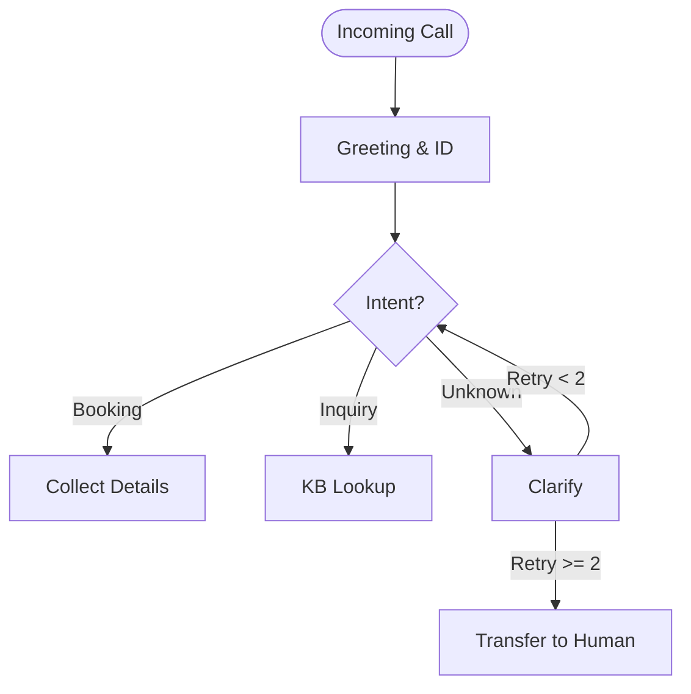

# Agent Ops — Flowchart Generator

Create two types of flowcharts for Inspra AI voice agent projects: **Call Flowcharts** (conversation logic) and **Networking Flowcharts** (SIP/telephony architecture for inbound agents).

## Input

Accept any of:
- Blueprint document (from `agent-ops-blueprint`)
- Call script or conversation outline
- Agent requirements description
- Existing system prompt

## Call Flowchart

Maps the full conversation path the voice agent follows.

### Standard Structure

```
Incoming/Outgoing Call
    ↓
Greeting & Identification
    ↓
Intent Detection
    ├── Intent A (e.g., Book Appointment)
    │       ↓ Collect details → Confirm → Book → Closing
    ├── Intent B (e.g., General Inquiry)
    │       ↓ Answer from KB → Offer next step → Closing
    ├── Intent C (e.g., Complaint/Escalation)
    │       ↓ Acknowledge → Collect info → Transfer to human
    └── Unrecognized Intent
            ↓ Clarify → Retry (max 2) → Fallback to human
    ↓
Closing & Summary
    ↓
Post-Call Actions (CRM update, notification, transcript save)
```

### Design Rules

- Every path must have an exit — no dead ends
- Include fallback/error handling at each decision point
- Max 2 retries on misunderstood intent before human transfer
- Show post-call automations (what happens after hangup)
- Label decision diamonds with the actual question or condition
- Note where tools/function calls fire (calendar check, CRM lookup, etc.)

### Output

**Primary**: Figma diagram via MCP — use `mcp__claude_ai_Figma__generate_diagram` to create the flowchart. Style:
- Green ovals: Start/End
- Blue rectangles: Agent speech/action
- Yellow diamonds: Decision points
- Orange rectangles: Tool/API calls
- Red rectangles: Error/fallback paths
- Arrows labeled with conditions

**Fallback**: If Figma MCP unavailable, output Mermaid:



## Networking Flowchart (Inbound Only)

Maps the telephony infrastructure — how calls physically reach the agent.

### Standard SIP Architecture

```
PSTN / Mobile Caller
    ↓
Telephony Provider (Twilio / Vonage / Telnyx)
    ↓
SIP Trunk
    ↓
Vapi Platform
    ↓
Agent Router
    ├── Agent A (Reception)
    ├── Agent B (Sales)
    └── Agent C (Support)
    ↓
Transfer Path (if needed)
    ├── Back to IVR
    ├── Direct to human (SIP/phone)
    └── Voicemail
```

### Design Rules

- Show the full path from caller to agent
- Include failover paths (what if Vapi is down? what if agent times out?)
- Label each hop with protocol (SIP, WebSocket, HTTPS)
- Show where recording/transcription happens
- Note any compliance points (call recording consent, data residency)

### Output

Same as call flowchart — use `mcp__claude_ai_Figma__generate_diagram` as primary, Mermaid as fallback. Style networking diagrams with:
- Gray boxes: External systems (PSTN, provider)
- Blue boxes: Vapi platform components
- Green boxes: Active agents
- Dashed lines: Failover/backup paths

## When to Generate Which

- **Outbound agent**: Call flowchart only
- **Inbound agent**: Both call flowchart AND networking flowchart
- **Both**: All diagrams
