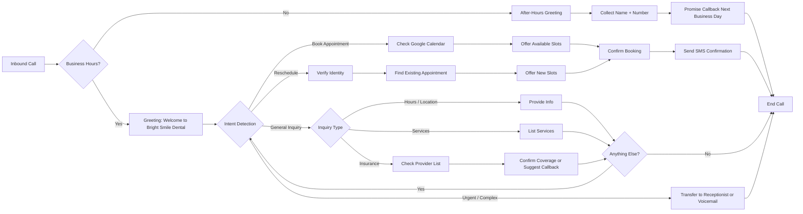

# Project Blueprint — Bright Smile Dental AI Receptionist

**Client:** Bright Smile Dental
**Location:** Parramatta, Sydney
**Date:** 10 March 2026
**Prepared by:** Inspra Agent Ops

---

## 1. Executive Summary

Bright Smile Dental is a 3-dentist practice in Parramatta losing approximately 30% of inbound calls during peak hours (10am-2pm) due to their receptionist being unable to manage phone calls and walk-in patients simultaneously. This blueprint outlines the design and deployment of an AI voice receptionist to handle appointment booking, rescheduling, general inquiries, insurance questions, and after-hours calls — with the goal of recovering lost calls and demonstrating clear ROI within 3 months.

---

## 2. Client Profile

| Field | Detail |
|---|---|
| Business Name | Bright Smile Dental |
| Industry | Dental / Healthcare |
| Location | Parramatta, Sydney |
| Practice Size | 3 dentists |
| Operating Hours | Mon–Sat, 8:00 AM – 6:00 PM |
| Key Contacts | Dr. Sarah Chen (Owner), Maria (Office Manager) |
| Current Scheduling Tool | Google Calendar |
| Website | Basic (exists but limited) |
| Budget | Flexible; ROI expected within 3 months |

---

## 3. Problem Statement

- **30% of inbound calls go unanswered** during peak hours (10am-2pm).
- The sole receptionist cannot simultaneously answer phones and serve walk-in patients.
- Missed calls lead to lost bookings, reduced revenue, and poor patient experience.
- After-hours calls currently go to a basic voicemail with no structured follow-up.
- Competitors are adopting chatbots, but the client specifically wants a **voice-first** solution for a more personal patient experience.

---

## 4. Project Objectives

1. **Eliminate missed calls** — target 95%+ answer rate during business hours.
2. **Automate appointment booking and rescheduling** via Google Calendar integration.
3. **Handle general inquiries** (hours, location, services, insurance) without human involvement.
4. **Provide structured after-hours call handling** with callback promises.
5. **Deliver warm, professional voice experience** — not robotic.
6. **Demonstrate measurable ROI within 3 months** (recovered bookings, reduced receptionist burden).

---

## 5. Agent Specification

| Parameter | Value |
|---|---|
| Agent Type | Inbound AI Voice Receptionist |
| Platform | To be confirmed (Vapi / Livekit) |
| Voice Style | Warm, professional, Australian-friendly tone |
| Language | English (Australian) |
| Escalation Path | Transfer to receptionist (during hours) or voicemail (after hours) |

### 5.1 Core Capabilities

| Capability | Description |
|---|---|
| **Appointment Booking** | Check Google Calendar availability, offer slots, confirm booking, send SMS confirmation |
| **Appointment Rescheduling** | Verify caller identity, locate existing appointment, offer alternative slots, confirm change |
| **General Inquiries** | Respond to questions about hours, location, directions, and services offered |
| **Insurance Questions** | Confirm whether caller's insurance provider is accepted; escalate edge cases |
| **After-Hours Handling** | Greet caller, collect name and number, promise callback next business day |
| **Escalation** | Transfer urgent, complex, or emotional callers to human receptionist or voicemail |

### 5.2 Accepted Insurance Providers (to be confirmed with client)

The AI will maintain a list of accepted major insurance providers and confirm coverage during calls. Edge cases (uncommon providers, specific plan questions) will be escalated to Maria or the relevant staff member.

---

## 6. Call Flow Architecture

> **Note:** FigJam diagram generation was unavailable. The Mermaid diagram below serves as the architectural reference.

### 6.1 Flow Breakdown

1. **Call Arrival** — System determines if the call is within business hours (Mon-Sat 8am-6pm AEST).
2. **After-Hours Path** — Warm greeting, collect caller details, promise next-business-day callback, end call. Details logged for Maria to action.
3. **Business Hours Greeting** — "Hi, thanks for calling Bright Smile Dental in Parramatta. How can I help you today?"
4. **Intent Detection** — Natural language understanding classifies caller intent into: booking, rescheduling, inquiry, or escalation.
5. **Booking Path** — Query Google Calendar API for available slots across all 3 dentists, offer options, confirm, send SMS.
6. **Rescheduling Path** — Verify identity (name + DOB or phone number), find appointment, offer new slot, confirm change.
7. **Inquiry Path** — Branch into hours/location, services, or insurance sub-flows. Loop back for additional questions.
8. **Escalation Path** — Urgent dental issues, distressed callers, or complex situations transferred to human receptionist (during hours) or voicemail (after hours).

---

## 7. Technical Architecture

### 7.1 Integrations

| System | Purpose | Method |
|---|---|---|
| **Google Calendar** | Read/write appointments for all 3 dentists | Google Calendar API (OAuth 2.0) |
| **SMS Gateway** (e.g., Twilio) | Send appointment confirmations and reminders | Twilio API / platform-native SMS |
| **Phone Provider** | Inbound call routing to AI agent | Platform SIP trunk or forwarding |
| **CRM / Patient Records** (future) | Caller identification, history lookup | TBD — Phase 2 |

### 7.2 Data Requirements from Client

- [ ] Google Calendar access credentials (all 3 dentists' calendars)
- [ ] Complete list of accepted insurance providers
- [ ] Full list of services offered with brief descriptions
- [ ] Appointment types and durations (e.g., checkup = 30 min, cleaning = 45 min)
- [ ] Clinic address, phone, parking/transport info for inquiry responses
- [ ] Preferred SMS sender name and confirmation message template
- [ ] Escalation phone number(s) and voicemail setup
- [ ] Any existing patient verification process details

---

## 8. Voice & Persona Design

| Attribute | Specification |
|---|---|
| Name | To be decided with client (e.g., "Sophie" or simply "Bright Smile Dental assistant") |
| Tone | Warm, friendly, professional — approachable but not overly casual |
| Pace | Moderate; clear enunciation for phone clarity |
| Accent | Neutral Australian English |
| Personality Traits | Helpful, patient, reassuring (especially for dental-anxious callers) |
| Robotic Avoidance | Use natural filler phrases, varied responses, empathetic acknowledgments |

### 8.1 Sample Dialogue Snippets

**Greeting (Business Hours):**
> "Hi, thanks for calling Bright Smile Dental in Parramatta! I'm here to help — are you looking to book an appointment, or is there something else I can assist with?"

**Booking Confirmation:**
> "Great, I've got you booked in with Dr. Chen on Thursday the 14th at 10:30 AM for a general checkup. You'll get a text confirmation shortly. Is there anything else I can help with?"

**Insurance Check:**
> "We accept most major insurance providers. Could you let me know which fund you're with, and I'll check for you?"

**After-Hours:**
> "Thanks for calling Bright Smile Dental. We're currently closed — our hours are Monday to Saturday, 8 AM to 6 PM. If you leave your name and number, we'll call you back on the next business day."

---

## 9. Success Metrics & ROI Framework

### 9.1 Key Performance Indicators

| KPI | Baseline (Current) | Target (3 Months) |
|---|---|---|
| Call Answer Rate | ~70% | 95%+ |
| Calls Handled by AI (no human needed) | 0% | 70%+ |
| Appointments Booked via AI | 0 | 150+/month |
| Average Call Duration | N/A | Under 3 minutes |
| Patient Satisfaction (post-call survey) | N/A | 4.5+/5 |
| Receptionist Phone Time Reduction | Baseline TBD | 50%+ reduction |

### 9.2 ROI Calculation Model

**Assumptions (to validate with client):**
- Average booking value: ~AUD $200 (checkup + cleaning)
- Currently missing ~30% of calls during peak = estimated 8-12 missed calls/day
- Conversion rate of answered calls to bookings: ~40%
- Working days/month: ~26

**Estimated Monthly Revenue Recovery:**
- Recovered calls: 10/day x 26 days = 260 calls/month
- Converted to bookings: 260 x 40% = 104 bookings/month
- Revenue recovered: 104 x $200 = **~AUD $20,800/month**

Even at conservative estimates (half the above), the AI receptionist should recover AUD $10,000+/month in previously lost revenue, comfortably exceeding platform and service costs.

---

## 10. Implementation Phases

### Phase 1 — Foundation (Weeks 1-2)
- Confirm platform selection (Vapi / Livekit)
- Gather all data requirements from client (Section 7.2)
- Set up Google Calendar API integration
- Design and build core call flows (booking, inquiry, after-hours)
- Configure voice persona and initial system prompt

### Phase 2 — Testing & Refinement (Weeks 3-4)
- Internal testing of all call paths
- UAT with Dr. Sarah Chen and Maria
- Tune intent detection and edge case handling
- Set up SMS confirmation pipeline
- Configure escalation routing

### Phase 3 — Soft Launch (Weeks 5-6)
- Deploy AI receptionist alongside human receptionist
- AI handles overflow calls (when receptionist is busy) and after-hours
- Monitor performance, collect call logs, iterate on prompt
- Gather initial patient feedback

### Phase 4 — Full Deployment (Weeks 7-8)
- AI becomes primary call handler
- Receptionist focuses on walk-ins and complex cases
- Establish ongoing monitoring dashboard
- Weekly performance review with Maria

### Phase 5 — Optimization & Expansion (Months 3+)
- Analyze 3-month performance data against ROI targets
- Add appointment reminder calls (outbound)
- Explore patient record integration (CRM)
- Consider multilingual support if needed (Mandarin, Arabic — Parramatta demographics)

---

## 11. Risk Register

| Risk | Likelihood | Impact | Mitigation |
|---|---|---|---|
| Caller frustration with AI | Medium | High | Warm persona design; easy escalation to human; continuous prompt tuning |
| Google Calendar sync issues | Low | High | Real-time API polling; error handling with graceful fallback ("Let me have someone call you back") |
| Misunderstood intent / wrong booking | Medium | Medium | Confirmation step before finalizing; caller repeats key details |
| Insurance edge cases | Medium | Low | Maintain updated provider list; escalate unknowns to Maria |
| After-hours emergency calls | Low | High | Clear messaging to call 000 for emergencies; do not provide medical advice |
| Low patient adoption | Low | Medium | Natural voice experience; no menu trees; gradual rollout with human backup |

---

## 12. Open Items & Next Steps

- [ ] **Confirm platform:** Vapi or Livekit — pending discussion with client
- [ ] **Confirm agent direction:** Inbound confirmed; discuss potential future outbound (reminders)
- [ ] **Collect data package** from Maria (calendars, insurance list, services, appointment types)
- [ ] **Schedule kickoff meeting** with Dr. Sarah Chen and Maria
- [ ] **Agree on AI persona name** and voice selection
- [ ] **Define escalation protocol** — when exactly should AI transfer to human?
- [ ] **SMS provider selection** — confirm Twilio or alternative
- [ ] **Determine patient verification method** for rescheduling (name + DOB vs. name + phone)

---

## 13. Competitive Advantage

The client noted competitors are using chatbots. A voice AI receptionist provides distinct advantages:

- **Accessibility** — Works for all patients, including elderly or less tech-savvy demographics common in dental practices
- **Personal touch** — Voice interaction feels warmer and more human than text chatbots
- **No app/website required** — Patients just call the same number they always have
- **Immediate resolution** — No waiting for chat responses; real-time conversation
- **After-hours coverage** — Chatbots require patients to visit a website; voice AI answers the phone 24/7

---

*This blueprint is a living document and will be updated as the project progresses through implementation phases.*
